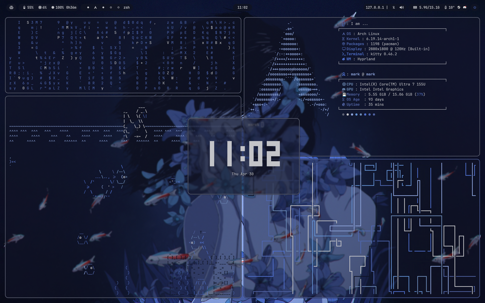

# Hyprland Rice

Welcome to my Hyprland Rice configuration! This setup is designed to provide a clean, efficient, and visually appealing desktop environment.

## Dependencies

- **Window Manager**: [Hyprland](https://github.com/hyprwm/Hyprland) - A dynamic tiling Wayland compositor.
- **Compositor**: Wayland for smooth and modern graphics.
- **Terminal**: [Kitty](https://sw.kovidgoyal.net/kitty/) - A fast, feature-rich, GPU-based terminal emulator.
- **Launcher**: [Wofi](https://hg.sr.ht/~scoopta/wofi) - A Wayland-native application launcher.
- **Bar**: [Waybar](https://github.com/Alexays/Waybar) - A highly customizable status bar.
- **Notifications**: [Mako](https://github.com/emersion/mako) - A lightweight Wayland notification daemon.
- **Color Scheme Generator**: [Pywal16](https://github.com/adi1090x/pywal16) - A tool to generate and apply color schemes based on your wallpaper.

## Screenshots



## Installation

1. Clone this repository:
    ```bash
    git clone https://github.com/markart25/markdots
    cd markdots
    ```

2. Install the required dependencies:
    ```bash
    sudo pacman -S hyprland kitty wofi waybar mako zsh ttf-jetbrains-mono ttf-jetbrains-mono-nerd swww
    yay -S python-pywal16
    ```

3. Optional cool apps:
    ```bash
    sudo pacman -S fastfetch asciiquarium cmatrix btop
    ```

4. Copy the configuration files to their respective locations:
    ```bash
    cp -r .config/* ~/.config/
    ```


5. Update the Waybar and Wofi configuration (important):
    If your Waybar and Wofi configuration references a CSS file like:
    ```
    @import "/home/mark/.cache/wal/colors-waybar.css";
    ``` 
    make sure to replace "mark" with your actual username.

6. Restart your session and enjoy your new setup!

## Customization

Feel free to tweak the configuration files in the `~/.config` directory to suit your preferences.

Enjoy your Hyprland rice!

## Extra Info

All important configs will be in ~/.config/hypr/config

the file `/home/mark/.config/fastfetch/rename-to-just-ascii-to-use` can be renamed to `ascii` and will show up when you type in the terminal:
```bash
fastfetch
```
mainmod (usually windows key) + T to open terminal. Then 
```bash
cat ~/.config/hypr/configs/keybinds.conf
```
to veiw all keybinds in hyprland

